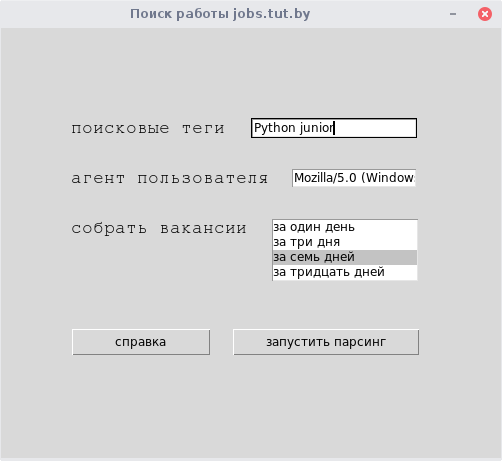
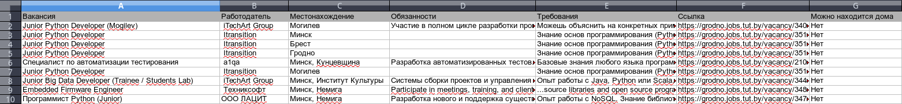

 Парсер вакансий на beautifulsoup в форме оконной программы на Tkinter.

Cайт для парсинга: https://jobs.tut.by/ 

Функциональность: 
1) Выбор срока за который собрать вакансии(1 день, 3 дня, неделя, месяц)
2) Поиск по ключевым словам(одно или два поисковых тега)
3) Выгрузка данных в формате Excel

